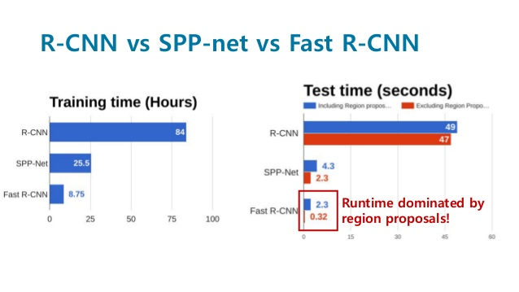

# Machine Learning

## Inspirenet study

### You will do the best

Introduction to Machine Learning

- dd
- dd
- dd
- dd

| ss   | ss   | ss   |
| ---- | ---- | ---- |
| ss   | ss   | ss   |
| ss   | ss   | ss   |
|      |      |      |

$$
\theta_{MLE} = argmax_{\theta}\; P(data|\theta)
$$
$x^2 + y^2 = z^2$

$$\int_{a}^{b} x^2 dx$$

$$\iiint_V \mu(u,v,w) \,du\,dv\,dw$$

