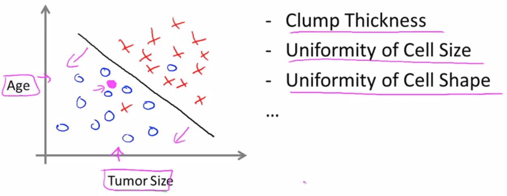

# Week 1. February 13th 2018 

## Welcome to Machine Learning!

Machine Learning has been using everywhere such as Google searching, recommendation of friends on Facebook, Apple's photo application, mail filtering and so on. There's a science of getting computers to learn without being explicitly programmed.

## Welcome

Machine Learning 

- Field that had grown out of the field of AI
- New capability for computers(it touches many segments of industry)

Applications :

- Database mining with large datasets from growth of web and automation

  ​	E.g. Web click data, medical records, biology, engineering

- Applications cannot be programmed by hand

  ​	E.g. Autonomous helicopter, handwriting recognition, NLP, computer vision

- Self-customizing programs

  ​	E.g. Amazon, Netflix product recommendations

- Understanding human learning

## What is Machine Learning?

Definition

- Arthur Samuel(1959) - field of study that gives computers the ability to learn without being explicitly programmed
- Tom Mitchell(1998) - A computer program is said to learn from experience E with respect to some task T and some performance measure P, if its performance on T, as measured by P, improves with experience E
   - E : Watching you label emails as spam or not spam
   - T : Classifying emails as spam or not spam
   - P : The number of emails correctly classified as spam/not spam

Machine learning algorithms :

- Supervised learning
- Unsupervised learning
- Others : Reinforcement learning, recommender systems

Machine learning is just a tool. It is important to how to apply this tool properly on your problems. I hope to make you one of the best people in knowing how to design and build serious machine learning and AI systems.

## Supervised Learning

Supervised learning refers to that there is a data set in which the "right answers" are given. There are two types of supervised learning problems.

1) Regression Problem : predict a continuous value output

Let's see an example. 

You have a data set about housing price with this plot. X-axis represents size of house and Y-axis represents price of house. The problem is "How much would you get for the house when its size is 750 square feet?".

Our goal is predicting price of the house. The target(price) is a real number and there is given the price data set we can refer to. Thus, this is a regression problem in supervised learning.

In order to make a prediction, you might are able to draw some lines representing this data well. With straight line(blue), maybe the house can be sold about \$150K while the price would be closer to \$200K with quadratic function(purple). Then which one do you need to choose? We'll talk about how to decide the function to fit the data later.

2) Classification Problem : predict a discrete value output

Let's see an example. 

You have a data set about type of breast cancer with this plot. X-axis represents size of tumor and Y-axis represents age of patients. And blue 'O' and red 'X' marks denote each benign(harmless tumor) and malignant(harmful tumor). The problem is "What kind of tumors is your friend's tumor given his or her age and size of tumor(pink point in the plot)?".

Our purpose is estimating the probability about type of the tumor. The target(type) is a discrete class and there is given types of tumor data set we can refer to. Thus, this is a classification problem in supervised learning.

For the plot, the most intuitive and reasonable line for dividing classes looks like the black cross line. Probably you might judge your friend's tumor is benign. Does it make sense?

In classification problems, you will often have more features(sometimes can be infinite number of features) and more than values for the output. Then you'll be able to come up with an algorithm that can deal with that problems. When you meet the problem has an infinite number of features, you can use an algorithm called the Support Vector Machine, there will be a neat mathematical trick that will allow a computer to deal with an infinite number of features.

## Unsupervised Learning

Unsupervised learning doesn't have all same label or no labels(answers). So we're given the data set and we're not told what to do with it and what each data point is. Instead, the problem is like that "Can you find some structure in the data?"

One of tasks you could do with this data is breaking this data into two separate clusters. There are some applications clustering is used.

1.  Organize computing clusters
2.  Social network analysis
3.  Market segmentation
4.  Astronomical data analysis 

Here is another example of unsupervised learning which is called cocktail party problem. 

What you need to do is separate out two mixed sound sources from recordings.

We talked about Unsupervised Learning, which is a learning setting where you give the algorithm a ton of data and just ask it to find structure in the data for us.

## Linear regression

Here is training set of housing prices.

| Size in feet$^2$ (x) | Price($) in 1000's (y) |
| -------------------- | ---------------------- |
| 2104                 | 460                    |
| 1416                 | 232                    |
| 1534                 | 315                    |
| 852                  | 718                    |
| ...                  | ...                    |

Let's define some notation.

m = Number of training examples

x = "input" variable / features

y = "output" variable / "target" variable

(x, y) = single training example / (x$^i$, y$^i$) = $i$-th training example

$h_\theta (x) = \theta_0 + \theta_1 x$ ($\theta_i$ : Parameter)	 

$h_\theta (x) $ is a hypothesis function that maps from x to y. In short, it takes the value of x and put out estimated value of y. For good prediction, you are able to choose $\theta_0$ and $\theta_1$ so that $h_\theta (x) $ is close to y which is real value for our training examples(x, y). 

Let me give you one more important terminology in machine learning, cost function, which is also called object function. You can think of is as measuring indicator for good prediction, which is difference between hypothesis value and real value. 

 In this case, our cost function is
$$
J(\theta_0, \theta_1) = \frac{1}{2m} \sum_{i=1}^{m} (h_\theta (x^i) - y^i)^2
$$
$\frac{1}{2}$ makes math easier and squared error function is used here. Your ultimate goal is minimizing this cost function. In short, you can find optimal $\theta_1$and $\theta_1$ to minimize average of difference between predicted values and real values.
$$
minimize_{\theta_0 , \theta_1} J(\theta_0, \theta_1)
$$
Let's see the relationship between $h_\theta (x) $ and $ J(\theta_0, \theta_1)$ with graphs below.

If, $\theta_0 = 0$ 

$h_\theta (x) $ is a function of x for fixed $\theta_1$ and $J(\theta_1)$ is function of the parameter $\theta_1$

If, $\theta_0 \neq 0$

$ J(\theta_0, \theta_1)$ is showed with contour plot here. But you can imagine it as a bow shaped function that's coming out of your screen. So the bottom of bowl is the minimum point. Each of these ellipsis shows is a set of points that takes on the same value for $ J(\theta_0, \theta_1)$

## Gradient Descent

Gradient Descent is an algorithm for minimizing arbitrary function including cost function.

In our case, we have a cost function $ J(\theta_0, \theta_1)$ and want to minimize this.

Here is simple steps for this.

1. Initialize $\theta_0, \theta_1$
2. Keep changing $\theta_0, \theta_1$ to reduce $ J(\theta_0, \theta_1)$ until we hopefully end up at a minimum

In gradient descent, you want to go to downhill as quickly as possible when you are standing at a point on the hill by taking a little baby steps in some direction. What direction do you take to step in?

Probably you would take your steps toward steep slope and go down. But if you start at different location on the hill, the destination will be different also.

Let's see more details about gradient descent algorithm mathematically. This is the definition of the gradient descent algorithm. 

​	$\theta_j := \theta_j - \alpha \frac{\partial}{\partial \theta_j} J(\theta_0, \theta_1)$ 	(for $j$=0 and $j$=1)

​	$\alpha$ : learning rate (how big a step we take when updating parameters)

​	$\frac{\partial}{\partial \theta_j} J(\theta_0, \theta_1)$ : derivative term (slope)

We're going to just repeatedly do this until convergence.  And $\theta_j$ in this equation is updated simultaneously for all $j's$. (sharing same $ J(\theta_0, \theta_1)$ at each updating)

For proper implementation of gradient descent, a few things should be considered.

1. Learning rate($\alpha$) 

   - If $\alpha$ is too small, gradient descent can be slow                               

   - If $\alpha$ is too large, gradient descent can overshoot the minimum

      

2. Local minimum problem

   - As we approach a local minimum, gradient descent will automatically take smaller steps since the slope will more be gentle. Local optimum depends on initialization.      

## Gradient Descent For Linear Regression

Gradient descent algorithm

$\theta_j := \theta_j - \alpha \frac{\partial}{\partial \theta_j} J(\theta_0, \theta_1)$ 	(for $j$=0 and $j$=1)

Linear regression model

$h_\theta (x) = \theta_0 + \theta_1 x$

$J(\theta_0, \theta_1) = \frac{1}{2m} \sum_{i=1}^{m} (h_\theta (x^i) - y^i)^2$

 

As you updates parameters with gradient descent algorithm to minimize cost function $J(\theta_0, \theta_1) $, hypothesis $h_\theta (x)$ is changed. 

'Batch gradient descent' refers to the fact that in every step of gradient descent, we're looking at all of the training examples(m).

 