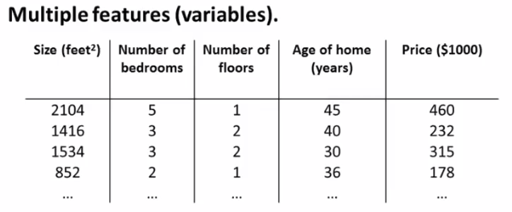
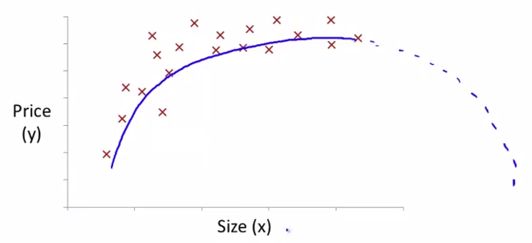
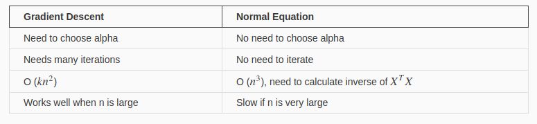

# Week 2. February 21th 2018 

## Multivariate Linear Regression

Multivariate Linear Regression is Linear regression with multiple variables. we now introduce some terms and notations below for equations where we can have any number of input variables.

- Terms and notations

  feature : some informative characteristics which a data has for some tasks.

  ​	e.g : dataset about many houses for predicting the price has some features such as the number of square meters, the number of rooms, distance from main streets and so on. 

  

  $$ x^{i}_j $$ = value of feature j in the i-th training example

  $$x^{i}$$ = the input (features) of the i-th training example

  m = the number of training examples

  n = the number of features.

- Multivariate hypothesis
  $$
  h_{\theta}(x) = \theta_{0} + \theta_1x_1 + \theta_2x_2 + \theta_3x_3 + ... \theta_nx_n \\
  h_{\theta}(x) = [ \theta_0 \; \theta_1 \; \theta_2 \; \cdots \; \theta_n]\begin{bmatrix} x_0 \\ x_1 \\ x_2 \\ \vdots \\ x_n\end{bmatrix} = \theta^{T}x
  $$
  This is a vectorization of our hypothesis for one training example.

- Gradient descent method for multivariate linear regression
  $$
  J(\theta) = \frac{1}{2m}\sum^m_{i=1}(h_\theta(x^{(i)})-y^{(i)})^2 = \frac{1}{2m}\sum^m_{i=1}(\theta^Tx^{(i)}-y^{(i)})^2 \\ \text{  Therefore  } \frac{\partial J(\theta)}{\partial \theta_j} = \frac{1}{m}\sum^m_{i=1}(h_\theta(x^{(i)})-y^{(i)})x^{(i)}  \\
  $$
  As same as univariate regression, We have gradient descent equation ( $$ \theta_j =  \theta_{j} - \alpha\frac{1}{m}\frac{\partial J(\theta)}{\partial(\theta_j)} $$ 		) to update parameters. So we repeat the update until the parameters are converged.

  ​
  $$
  \text{repeat until convergence \{ }\\ \theta_j : =  \theta_{j} - \alpha\frac{1}{m}\sum^m_{i=1}(h_{\theta}(x^{(i)})-y^{(i)})\cdot x^{(i)}_j \;\;\text{for j := 0...n  \}}
  $$

- Feature scaling

  We can speed up gradient descent by having each of our input values in roughly the same range. This is because θ will descend quickly on small ranges and slowly on large ranges, and so will oscillate inefficiently down to the optimum when the variables are very uneven. In addition, features, which have larger range than other features, are considered more important features, because generally bigger value of feature may has bigger impact on tasks such as regression and classification and so on. 
  $$
  \text{feature scaling and mean normalization } \rightarrow  x_i := \frac{x_i - \mu_i}{\sigma_i}
  $$

- Non-linear form

  We can choose a non linear hypothesis to fit more complicated data distribution(non linear).

  

  E.g. $$h_\theta(x) = \theta_0 + \theta_1x_1 + \theta_2\sqrt{x_1}$$ 

  ​

## Normal equation

- Concept

  One of way to get optimal is gradient descent method we learned earlier. This way is getting derivatives of parameters from cost function and update parameters iteratively. 

  Let's discuss a second way called Normal equation. It's no more to calculate optimal parameter iteratively. we will minimize the cost function explicitly without iterative algorithm.

- getting the formula

  we'd like to minimize the least-square cost: $$J(\theta_0, \theta_1, \cdots, \theta_n) = \frac{1}{2m}\sum^m_{i=1}(h_\theta(x^{(i)})-y^{(i)})^2$$

  and we can write hypothesis $$h_\theta(x) = \theta^Tx$$

  When this is summed over all samples, we can dip further into matrix notation. We'll define the "design matrix" X (uppercase X) as a matrix of m rows, in which each row is the i-th sample (the vector ). With this, we can rewrite the least-squares cost as following, replacing the explicit sum by matrix multiplication:
  $$
  J(\theta) = \frac{1}{2m}(X\theta - y)^T(X\theta - y) \\
  J(\theta) = ( (X\theta)^T -y^T )(X\theta - y) = (\theta^TX^TX\theta -y^TX\theta -\theta^TX^Ty +y^Ty) \\
  = \theta^TX^TX\theta -2(X\theta)^Ty + y^Ty
  $$
  So we derive by each component of the vector, and then combine the resulting derivatives into a vector again. The result is:
  $$
  \frac{\partial J(\theta)}{\partial\theta} = 2X^TX\theta - 2X^Ty = 0 \\
  \text{or : } X^TX\theta = X^Ty \\
  \therefore \theta = (X^TX)^{-1}X^Ty
  $$
  which this is normal equation.

- Pros and Cons in contrast to Gradient Descent method

  

- what if  $$X^TX$$ is not invertible?

  - Redundant features, where two features are very closely related (i.e. they are linearly dependent). 

    but why? It's because $$rank(X^TX) = rank(X)$$. linearly dependency of X means rank of X is lower than n. If a transformation T is invertible, dim(T) = rank(T). So $$X^TX $$ is not invertible.

  - Too many features (e.g. m ≤ n). In this case, delete some features or use "regularization" (to be explained in a later lesson).

    but why? Matrix X of size m by (n+1) will have rank equal or less than **min(m,n+1)** when X is invertible. So if **m <= n**, then **rank(X) <= m**. $$(X^T)X$$ is a matrix of size (**n+1**) by **n+1**, but has rank equal or less than **m**, which is even smaller than **n+1**. So $$(X^TX)$$ is non-invertible.

  Solutions to the above problems include deleting a feature that is linearly dependent with another or deleting one or more features when there are too many features.

- references

  - https://eli.thegreenplace.net/2014/derivation-of-the-normal-equation-for-linear-regression
  - https://stats.stackexchange.com/questions/278755/why-use-gradient-descent-for-linear-regression-when-a-closed-form-math-solution
  - https://stackoverflow.com/questions/18191890/why-gradient-descent-when-we-can-solve-linear-regression-analytically
  - https://www.coursera.org/learn/machine-learning/discussions/weeks/2/threads/6_bIYDt1EeaVABKtWz_zNw
