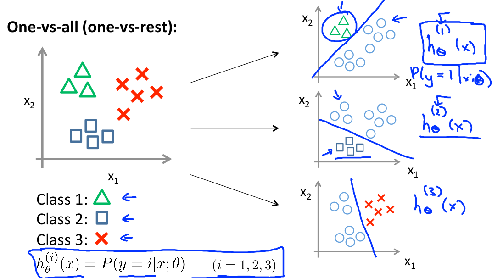
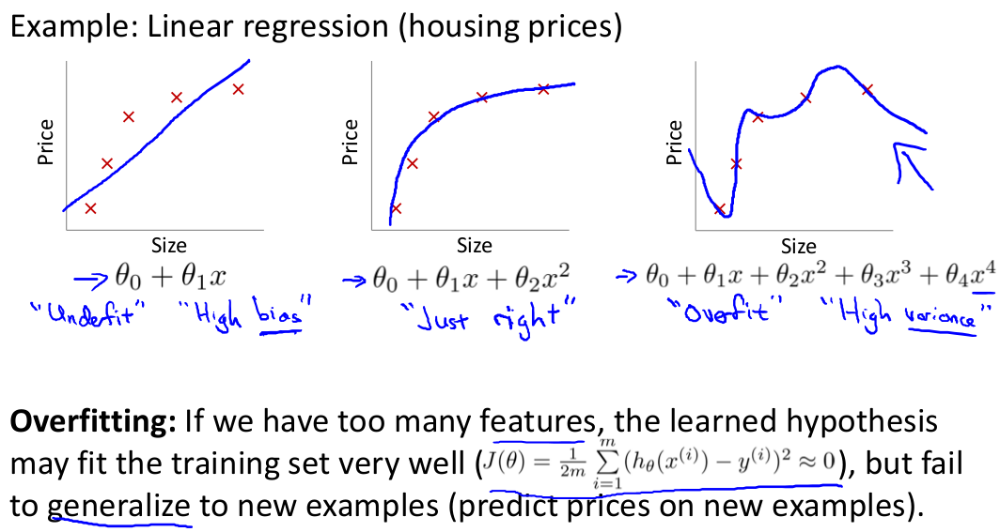

# Week 2. February 28th 2018

##Classification and Representation

- Classification

  - examples of classification problems

    - email spam classification
    - online transaction classification
      - fraudulent transaction or not
    - tumor classification
      - cancerous, malignant tumors or benign tumors

  -  property of classification problems

    - In all of these problems the variable that we're trying to predict is a variable y. and we know y must be either 0("negative class") or 1("positive class")

  - $$
    y=\{0,1\}
    $$

    - if 

  - $$
    y=\{0,1,2,3\}
    $$

    - then this is called a multiclass classifcation problem.

  - applying linear regression to a binary classification problem

    - **악성종양 그래프 사진**

    - if we fill a straight line to the graph, we can get a hypothesis($H(x)$)

    - in this case, 0.5 is the threshold
      $$
      if\ x<0.5, then\ y=0 \\
      if\ x>0.5, then\ y=1
      $$

  - but, linear regression isn't good idea 

    - 

    - in this case, if we run linear regression, we get a straight line fit to the data. but, that blue line is a worse hypothesis.

    - And it seems kind of strange that even though we know that the labels should be 0 or 1 it seems kind of strange if the algorithm can output values much larger than 1 or much smaller than 0.
      $$
      h_{\theta}(x)>1\ or\  h_{\theta}(x)<0
      $$

    - So, applying linear regression to a classification problem often isn't a great idea. 

  - logistic regression for classification algorithm

    - to fix above problems of linear regression, we can apply logistic regression.
    - It is confusing that the term "regression" appears in this name even though logistic regression is actually a classification algorithm.
    - But that's just a name it was given for historical reasons.

- hypothesis representation in logistic regression

  - $g(z)$

    - to satisfy the property that classifier output values that are between 0 and 1,
      $$
      0\le h_{\theta}(x)\le1
      $$

    -  we can come up with $h_{\theta}(x)$ like this
      $$
      h_{\theta}(x)=g(\theta^{T}x)\\
      z=\theta^{T}x\\
      g(z)=\frac{ 1 }{ 1+e^{-z} }
      $$

    - Our new form uses the "Sigmoid Function" $g(z)$, also called the "Logistic Function"

  - sigmoid function(or logistic function)

    - 
    - sigmoid function and logistic function are basically synonyms and mean the same thing.
    - Sigmoid function starts off near 0 and then it rises until it crosses 0.5 , and then it flattens out again like so. 
    - And while it asymptotes at 1 and asymptotes at 0, as a z axis, the horizontal axis is z. 
      As z goes to $-\infty$, g(z) approaches 0. And as z approaches $\infty$, g(z) approaches 1.

  - interpreting $h(x)$ by mathematical formula

    - let's think about that $h_{\theta}(x)$ will give us the probability that our output is 1. 

    - For example, $h_{\theta}(x)=0.7$ gives us a probability of 70% that our output is 1. Our probability that our prediction is 0 is just the complement of our probability that it is 1 (e.g. if probability that it is 1 is 70%, then the probability that it is 0 is 30%).

    - probability that y=1, given x, parameterized by $\theta$  can be written like this

    - $$
      h_{\theta}(x)=P(y=1|x;\theta)\\
      P(y=0|x;\theta)+P(y=1|x;\theta)=1\\
      P(y=1|x;\theta)=1-P(y=0|x;\theta)
      $$

- Decision Boundary

  - decision boundary will give us a better sense of what the logistic regressions hypothesis function is computing. 

  - interpreting the logistic function

    - if $\theta^{T}x\ge0 \Leftrightarrow h_\theta(x)\ge0.5$ then predict y=1
    - if $\theta^{T}x<0 \Leftrightarrow h_\theta(x)<0.5$ then predict y=0
    - 

  - training set example1

    - 

    - it's hypothese function h(x) is like this,
      $$
      h_\theta(x)=g(\theta_0+\theta_1x_1+\theta_2x_2)
      $$

    - Let's say we choose $\theta_0=3, \theta_1=1, \theta_2=1$. so, 
      $$
      \mathbf{\theta} =
      \left[ \begin{array}{ccc}
      3\\
      1\\
      1\\
      \end{array} \right]
      $$

    - predict "$y=1$" if $-3+x_1+x_2 \ge0\\\Leftrightarrow x_1+x_2 \ge3$

    - the line $x_1+x_2 = 3$ we call that "Decision boundary"

    - 

  - Decision Boundary
    - The decision boundary is the line that separates the area where y = 0 and where y = 1. It is created by our hypothesis function.
    - The decision boundary is the property of $h(x)$, not the property of dataset. dataset fit the parameters $\theta$, and they define the decision boundary.

  - training set example2

    - 
    - it's hypothese function h(x) is like this,
      $h_\theta(x)=g(\theta_0+\theta_1x_1+\theta_2x_2+\theta_3x_1^2+\theta_4x_2^2)$
    - predict "$y=1$" if $-1+x_1^2+x_2^2 \ge0\\\Leftrightarrow x_1^2+x_2^2 \ge1$
    - then we can set decision boundary like this,
      
    - more complex example then straight line or circle
      - we can come up with more complex dicision boundaries by adding x1 squared and x2 squared...etc. to our features
      - by higher autopolynomial features, you can find out very complex decision boundaries.

  ​
##Logistic Regression Model

- Cost function

  - in linear regression model

    - cost function J
      $$
      J(\theta) = \frac{1}{m}\sum^m_{i=1}\frac{1}{2}(h_\theta(x^{(i)})-y^{(i)})^2\\
      Cost(h_\theta(x^{(i)}),y^{(i)})=\frac12(h_\theta(x^{(i)})-y^{(i)})^2\\
      \therefore J(\theta) = \frac{1}{m}\sum^m_{i=1}Cost(h_\theta(x),y)
      $$

    - we learned cost function J previously, but in that case, cost function is convex function.

  - **convex and non-convex**

    - 
    - convex function
      - sigle bow-shaped function
      - if we run with $\theta$, we would be guaranteed with gradient descent that would converge to the global minimum
    - non-convex function
      - not single bow-shaped function
      - many local optima
      - e.g. sigmoid function

  - in logistic regression

    - sigmoid function is non-convex function

    - with a particular choice of cost function, this will give a **convex optimization problem**. but, topic of convexity analysis is beyond the scope of this course.

    - let us think about this cost function.

    - $$
      Cost(h_\theta(x),y) = 
      \left\{ \begin{array}{ll}
      -\log(h_\theta(x)) & \textrm{if y=1}\\
      -\log(1-h_\theta(x)) & \textrm{if y=0}\\
      \end{array}
      \right.
      $$

    - 

  - Simplified cost function and gradient descent

    - we can compress above function into one equation. note that y always be 0 or 1.

    - $$
      Cost(h_\theta(x),y) =-y\log(h_\theta(x)) -(1-y)\log(1-h_\theta(x))
      $$

    - so,
      $$
      J(\theta)=\frac{1}{m}\sum^m_{i=1}Cost(h_\theta(x^{(i)}),y^{(i)})\\=-\frac{1}{m}[\sum^m_{i=1}y^{(i)}\log(h_\theta(x^{(i)})) +(1-y^{(i)})\log(1-h_\theta(x^{(i)}))]
      $$
      ​

    - why does we use this cost function?

      - because, this cost function can be derived from statistics using the principle of maximum likelihood estimation Which is an idea in statistics for how to efficiently find parameters' data for different models.
      - And it also has a nice property that it is convex.

    - fitting parameters

      - Given this cost function, in order to fit the parameters, what we're going to do then is try to find the parameters $\theta$ that minimize $J(\theta)$
      - The way we're going to minimize the cost function is using gradient descent.

    - gradient descent

      - to run gradient descent,

      - $$
        \min_\theta J(\theta):Repeat\{ \\
         \theta_j : =  \theta_{j} - \alpha\frac{\partial }{\partial \theta_j}J(\theta)\\
        (simultanesous\ update\ all\ \theta_j)\\
        \}
        $$

      - **it can be written as**

      - $$
        \theta_j : =  \theta_{j} - \alpha\sum^m_{i=1}(h_\theta(x^{(i)})-y^{(i)})x_j^{(i)}\\
        \theta_j=\begin{bmatrix} \theta_0 \\\theta_1 \\\theta_2 \\ \vdots \\ \theta_n\end{bmatrix}
        $$

      - and, a hypothesis function is,
        $$
        h_\theta(x)=\frac{ 1 }{ 1+e^{-\theta^Tx} }
        $$
        so, notice that this is actually not the same thing as gradient descent for linear regression.

      - **a vectorized implementation** is,

        ​

        - 

        - 

    - feature scaling also applies to gradient descent for logistic regression,  And yet we have features that are on very different scale, then applying feature scaling can also make grading descent run faster for logistic regression. 

  - Advanced optimization algorithm

    - to minimize $J(\theta)$, there are other algorithm as well as gradient descent
    - **Other optimization algorithms**
      - conjugate gradient
      - BFGS
      - L-BFGS
    - Advantages of these three algorithms
      - No need to manually pick $a​$
      - Often faster than gradient descent
    - Disadvantages of these three algorithms
      - More complex

  - advanced optimization example using OCTAVE

    - fminunc()
    - optimset()

##Multiclass Classification

- example of multicalss classification

  - email foldering/tagging
    - work(y=1)
    - friends(y=2)
    - family(y=3)
    - hobby(y=4)
  - medical diagrams
    - not ill(y=0)
    - cold(y=1)
    - flu(y=2)
  - weather

- difference between Binary classification and Multiclass classification
  

- one-vs-all(one-vs-rest) classifcation

  - this is an idea for multiclass classification problems

  - It is to turn training set into three separate binary classification problems

  - 

  - We're going to essentially create a new sort of fake training set where class2 and class3 get assigned to the negative class. And class1 gets assigned to the positive class.

  - Next we do the same thing for class2, 3.

  - each hypothesis function is like this,
    $$
    h_\theta^{(i)}(x)=P(y=i|x;\theta),\ (class\ i=1,2,3)
    $$

  - it train a logistic regression classifier $h^{(i)}_\theta(x)$ for each class $i$ to predict the probability that $y = i$

  - after training, we just run all three of our classifiers on the input $x$ and then pick the class $i$ that maximizes the $h(x)$
    $$
    if\ h_\theta^{(i1)}(x)=\max_ih_\theta^{(i)}(x),\\
    then\ y\ is\ predicted\ to\ be\ i1
    $$

##Solving the Problem of Overfitting

- the problem of overfitting 

  - 

  - 

  - underfitting or high bias

    - if we have too simple of too few features, the data clearly shows structure not captured by the model

  - overfitting or high variance

    - if we have too many features, the learned hypothesis may fit the training set very well
      $$
      J(\theta)\approx0
      $$

    - but fail to generalize to new examples(e.g. predict prices on new examples)

- how can we addess which parameters is overfitting

  - main cause of overfitting
    -  too many features
  - main options for addressing overfitting
    - option1 : reduce the number of features
      - manualy select which features to keep
        : which are the more important features
      - model selection algorithm
        : automatically decide to keep or throw out
    - option2 : regularization(weight decay)
      - keep all the features, but reduce magnitude/values of parameters $\theta_j$
      - works well when we have a lot of features, each of which contributes a bit to predicting $y$

- Cost function

  - regularization idea : small values for parameters $\theta_i$ 

    - "simpler" hypothesis $\to$ less prone to overfitting
    - 
    - but, there are lots of features, we t
    -

    - formula
      $$
      J(\theta)=
      \frac{1}{2m}[\sum_{i=1}^m(h_\theta(x^{(i)})-y^{(i)})^2+\lambda\sum_{j=1}^n\theta_j^2]
      $$
      ​

    - $\lambda$ is called the regularization parameter. and $\lambda$ trade off between fitting training set and keeping parameter small

    - more $\lambda$ is bigger, hypothesis will be simple to avoid overfitting

    - but if $\lambda$ is set to and extremely large lavue, it can be underfitting

  - Regularized linear regression

    - gradient descent

      - formula
        $$
        Repeat\ \{\\
        \theta_0 : =  \theta_{0} - \alpha\frac{1}{m}\sum^m_{i=1}(h_\theta(x^{(i)})-y^{(i)})x_0^{(i)}\\
        (\theta_0\ doesn't\ exist)\\
        \theta_j : =  \theta_{j} - \alpha [ \frac{1}{m}\sum^m_{i=1}(h_\theta(x^{(i)})-y^{(i)})x_j^{(i)}+\frac{\lambda}{m}\theta_j]\\
        \Leftrightarrow\\
        \theta_j : =  \theta_{j}(1-a\frac{\lambda}{m}) - \alpha [ \frac{1}{m}\sum^m_{i=1}(h_\theta(x^{(i)})-y^{(i)})x_j^{(i)}\\
        \\
        \}
        $$

  - $ (1-a\frac{\lambda}{m}) < 1$

​    because a is small and m is large. so, $\theta_j$ is shrinking bit by bit.

- normal equation

  - 

  - 

  - To add in regularization, the equation is the same as our original, except that we add another term inside the parentheses:
    $$
    \theta=(X^TX+\lambda L)^{-1}X^{T}y\\
    where\ \mathbf{L} =
    \left( \begin{array}{ccc}
    0 & 0 & \ldots \\
    0 & 1 & \ldots \\
    \vdots & \vdots & 1
    \end{array} \right)
    $$

  - L is a matrix with 0 at the top left and 1's down the diagonal, with 0's everywhere else. It should have dimension (n+1)×(n+1). Intuitively, this is the identity matrix, multiplied with a single real number λ.

  - Recall that if m < n, then $X^TX$ is non-invertible. However, when we add the term $λ⋅L$, then $X^TX + λ⋅L$ becomes invertible.

  - Regularized logistic regression

    - 

    - gradient descent

      - formula
        $$
        Repeat\ \{\\
        \theta_0 : =  \theta_{0} - \alpha\frac{1}{m}\sum^m_{i=1}(h_\theta(x^{(i)})-y^{(i)})x_0^{(i)}\\
        \theta_j : =  \theta_{j} - \alpha [ \frac{1}{m}\sum^m_{i=1}(h_\theta(x^{(i)})-y^{(i)})x_j^{(i)}+\frac{\lambda}{m}\theta_j]\\
        \Leftrightarrow\\
        \theta_j : =  \theta_{j}(1-a\frac{\lambda}{m}) - \alpha [ \frac{1}{m}\sum^m_{i=1}(h_\theta(x^{(i)})-y^{(i)})x_j^{(i)}\\
        \\
        \}
        $$

      - it looks cosmetically the same as case of linear regression, but notice that hypothesis is different.

  - advanced optimization example using OCTAVE

