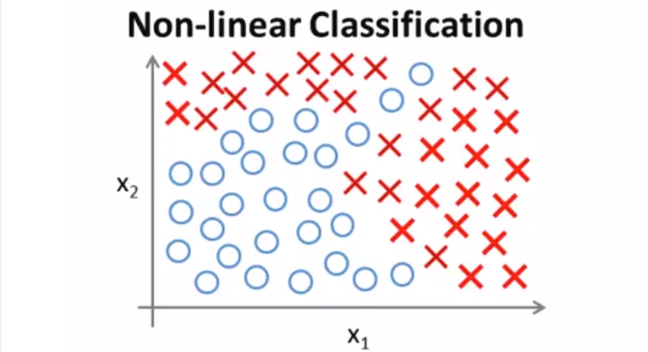
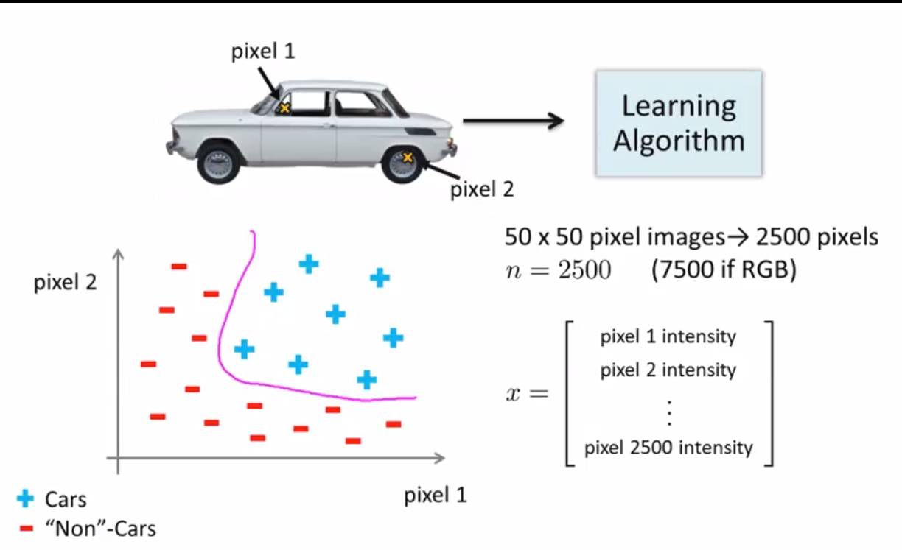
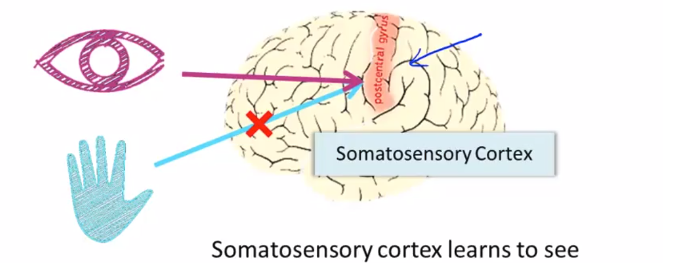
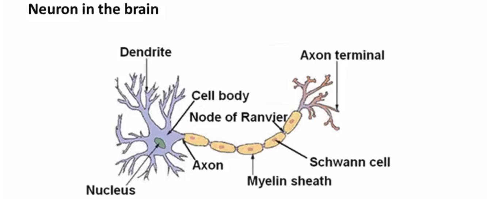
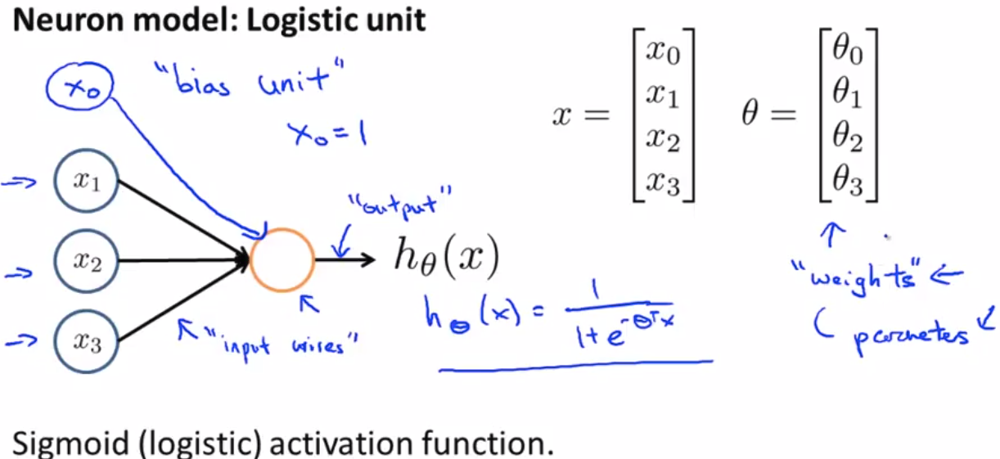
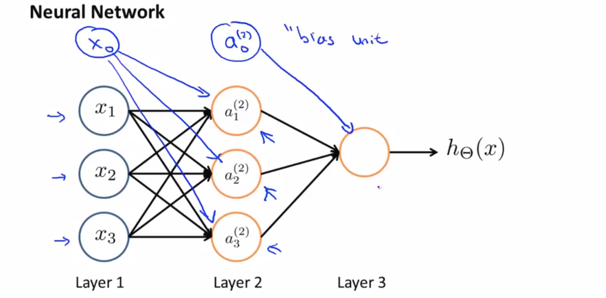
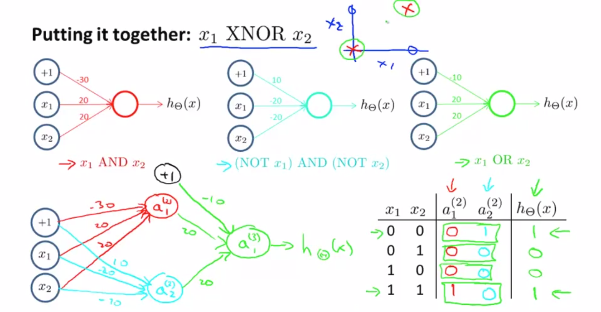
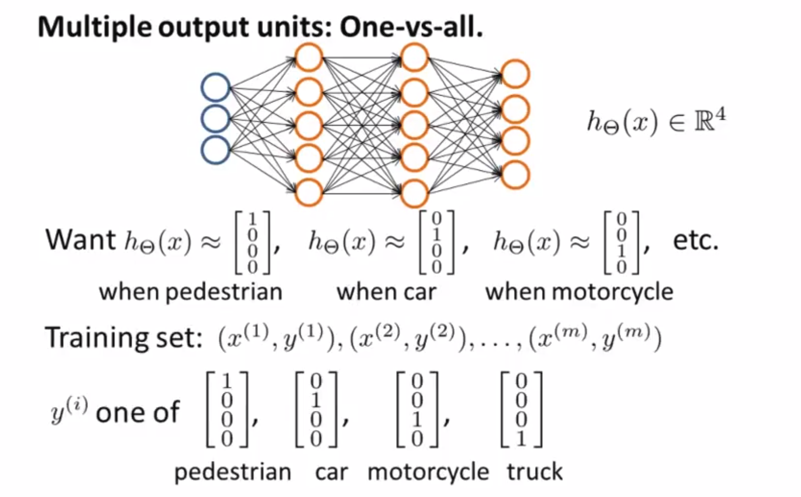

# Week 4. March 7th 2018

We dealt with linear regression and logistic regression so far. Let's see machine learning problems where we need to learn complex non-linear hypotheses. 

For example, in the non-linear classification problem

Maybe we can get a hypothesis like this.
$$
g(\theta_0 + \theta_1 x_1 + \theta_2 x_2 + \theta_3 x_1 x_2 + \theta_4 x^2_1 x_2 + \theta_5 x^3_1 x_2 + ...   )
$$

$$
g : Activation function
$$

When we want to include all of M order terms with N features,  the number of representation is $O(n^m)$ .

It can be computationally very expensive for training example!!

For image classification problem(car classification in this case),

Each pixel can be a feature and represented as element of vector like above. 

 ## How does our brain learn something

You can plug in almost any sensor to the brain and the brain's learning algorithm will just figure out how to learn from that data and deal with the data.

Instead of needing to implement a thousand different programs or algorithms, what we need to do is figure out the brain's learning algorithm to process different types of data. 

## Structure of Neuron

Dendrite(수상돌기) : Input wire - receive inputs from other locations

Axon(축색돌기) : Output wire - send signals to other neurons

Neurons communicate with each other with little pulses of electricity, they are also called spikes. 

## Representation of neural networks

Yellow circle : body of neuron

$x$ : inputs ($x_0$ : bias unit, optional)  

$\theta$ : weights or parameters

Layer 1 is called input layer.

Layer 2 is called hidden layer.

Layer 3 is called output layer.

$a_i ^{(j)}$ : "activation" of  unit $i$ in layer $j$

$\theta^{(j)}$ : matrix of weights controlling function mapping from layer $j$ to layer $j+1$
$$
a_1^{(2)} = g(\theta_{10}^{(1)} x_0 + \theta_{11}^{(1)} x_1 + \theta_{12}^{(1)} x_2 + \theta_{13}^{(1)} x_3)
$$

$$
a_2^{(2)} = g(\theta_{20}^{(1)} x_0 + \theta_{21}^{(1)} x_1 + \theta_{22}^{(1)} x_2 + \theta_{23}^{(1)} x_3)
$$

$$
a_3^{(2)} = g(\theta_{30}^{(1)} x_0 + \theta_{31}^{(1)} x_1 + \theta_{32}^{(1)} x_2 + \theta_{33}^{(1)} x_3)
$$

$$
h_\theta (x) = a_1^{(3)} = g(\theta_{10}^{(2)} a_0^{(2)} + \theta_{11}^{(2)} a_1^{(2)} + \theta_{12}^{(2)} a_2^{(2)} + \theta_{13}^{(2)} a_3^{(2)})
$$

If network has $s_j$ units in layer $j$, $s_{j+1}$ units in layer $j+1$, then $\theta^{(j)}$ will be of dimension $s_{j+1} \times (s_j + 1)$.    

Dimension = (the number of neurons in the following layer) X (the number of neurons in previous layer + 1 : bias) 

## Forward propagation : Vectorized implementation

Let's rewrite some terms in parenthesis. 

$\theta_{10}^{(1)} x_0 + \theta_{11}^{(1)} x_1 + \theta_{12}^{(1)} x_2 + \theta_{13}^{(1)} x_3 \Rightarrow z_1^{(2)}$, $a_1^{(2)} = g(z_1^{(2)})$

$\theta_{20}^{(1)} x_0 + \theta_{21}^{(1)} x_1 + \theta_{22}^{(1)} x_2 + \theta_{23}^{(1)} x_3 \Rightarrow z_2^{(2)}$, $a_2^{(2)} = g(z_2^{(2)})$

$\theta_{30}^{(1)} x_0 + \theta_{31}^{(1)} x_1 + \theta_{32}^{(1)} x_2 + \theta_{33}^{(1)} x_3 \Rightarrow z_3^{(2)}$, $a_3^{(2)} = g(z_3^{(2)})$

$x = \begin{bmatrix}x_0 \\ x_1 \\ x_2 \\ x_3\end{bmatrix}$	$z^{(2)} = \begin{bmatrix}z_1^{(2)} \\ z_2^{(2)} \\ z_3^{(2)} \end{bmatrix}$ 

$h_\theta (x) = a^{(3)} = g(z^{(3)})$ , $z^{(3)} = \theta^{(2)}a^{(2)}$

The bottom line is hypothesis $h_\theta (x)$ can be made by raw inputs $x_1, x_2, x_3$ since you can represent more complex non-linearity as you make network deeper.

## How a Neural Network can compute complex non-linear hypothesis

The deeper layer in Neural Network can compute more complex function. 

## Multi-class Classification

Input : images (pedestrian, car, motorcycle or truck)

Output : one-hot vector representation which refers to one of input images