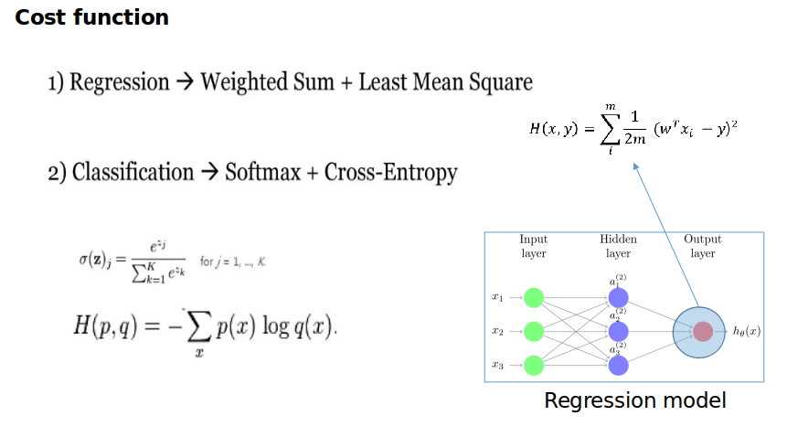
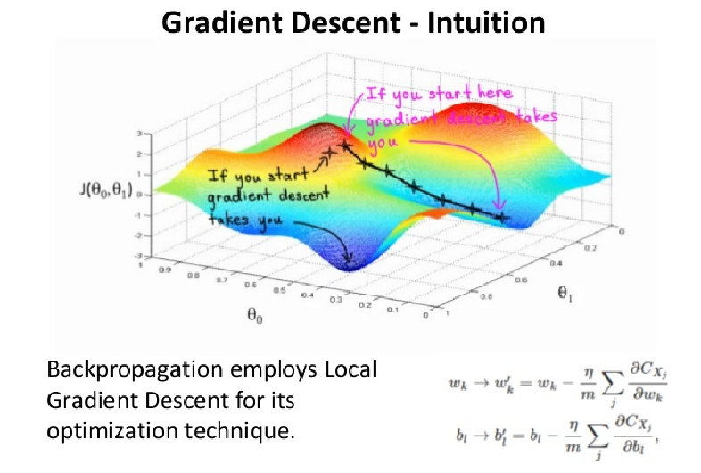
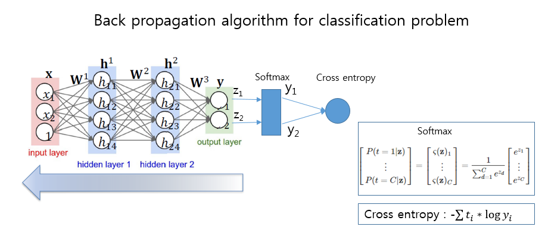
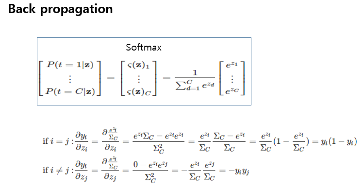
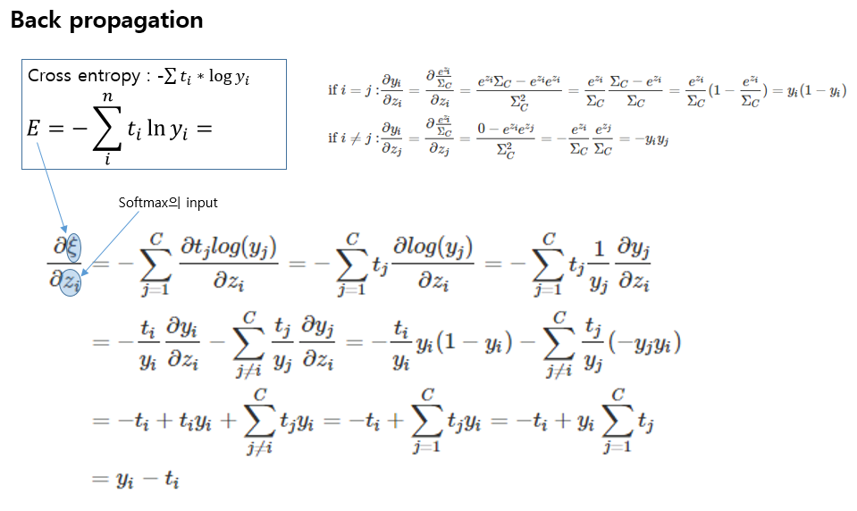
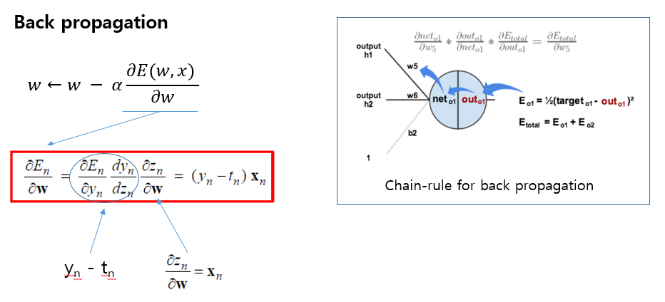

# Week 5. March 14th 2018

## 1. Cost function

cost function says how much error our model has for a batch dataset. Stochastic gradient method we have learned earlier updates parameters of our model with the result of cost function. 

## 2. Back-propagation

 in many cases, we need to train non linear model for analyzing complicated data distributions. Back-propagation introduced today makes stochastic gradient method train non-linear, but differential models. 

We need to calculate the derivative of cost function of a parameter for updating the parameter like below.
$$
w \leftarrow w - \alpha \frac{\partial E(w, x)}{\partial w}
$$
Let's assume our model is for a classification task. In that case, the cost function may be cross entropy. From cost function(cross entropy), The back-propagation algorithm conveys derivatives to parameters you want to update with the form of chain rule. 

### 2-1. Derivatives from output of Softmax layer to input of softmax layer.

### 2-2. Derivatives from cross entropy to input of Softmax layer.

### 2-3. Derivatives from Softmax layer to each parameter with chain rule.

