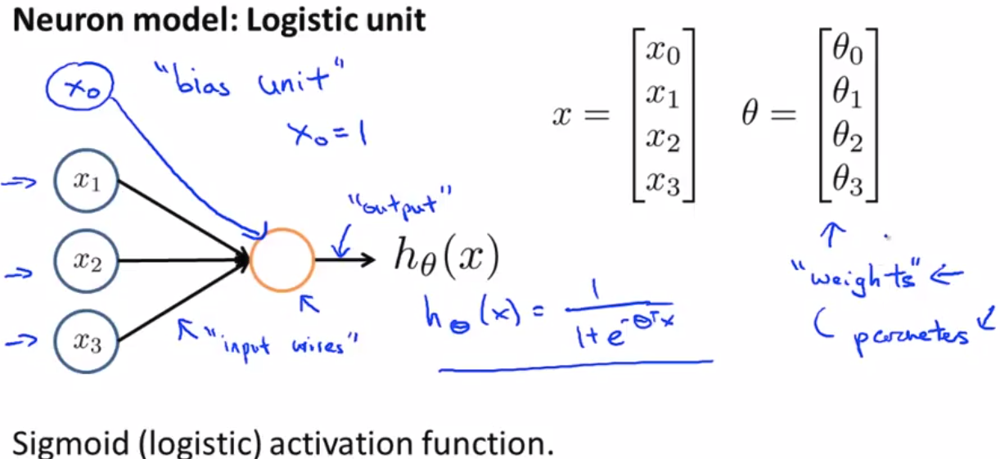

# Week 5. March 14th 2018

## 1. Cost function

cost function says how much error our model has for a batch dataset. Stochastic gradient method we have learned earlier updates parameters of our model with the result of cost function. 

## 2. Back-propagation

 in many cases, we need to train non linear model for analyzing complicated data distributions. Back-propagation introduced today makes stochastic gradient method train non-linear, but differential models. 

We need to calculate the derivative of cost function of a parameter for updating the parameter
$$
w \leftarrow w - \alpha \frac{\partial E(w, x)}{\partial w}
$$

## Representation of neural networks

Yellow circle : body of neuron

$x$ : inputs ($x_0$ : bias unit, optional)  

$\theta$ : weights or parameters

Layer 1 is called input layer.

Layer 2 is called hidden layer.

Layer 3 is called output layer.

$a_i ^{(j)}$ : "activation" of  unit $i$ in layer $j$

$\theta^{(j)}$ : matrix of weights controlling function mapping from layer $j$ to layer $j+1$
$$
a_1^{(2)} = g(\theta_{10}^{(1)} x_0 + \theta_{11}^{(1)} x_1 + \theta_{12}^{(1)} x_2 + \theta_{13}^{(1)} x_3)
$$

$$
a_2^{(2)} = g(\theta_{20}^{(1)} x_0 + \theta_{21}^{(1)} x_1 + \theta_{22}^{(1)} x_2 + \theta_{23}^{(1)} x_3)
$$

$$
a_3^{(2)} = g(\theta_{30}^{(1)} x_0 + \theta_{31}^{(1)} x_1 + \theta_{32}^{(1)} x_2 + \theta_{33}^{(1)} x_3)
$$

$$
h_\theta (x) = a_1^{(3)} = g(\theta_{10}^{(2)} a_0^{(2)} + \theta_{11}^{(2)} a_1^{(2)} + \theta_{12}^{(2)} a_2^{(2)} + \theta_{13}^{(2)} a_3^{(2)})
$$

If network has $s_j$ units in layer $j$, $s_{j+1}$ units in layer $j+1$, then $\theta^{(j)}$ will be of dimension $s_{j+1} \times (s_j + 1)$.    

Dimension = (the number of neurons in the following layer) X (the number of neurons in previous layer + 1 : bias) 

## Forward propagation : Vectorized implementation

Let's rewrite some terms in parenthesis. 

$\theta_{10}^{(1)} x_0 + \theta_{11}^{(1)} x_1 + \theta_{12}^{(1)} x_2 + \theta_{13}^{(1)} x_3 \Rightarrow z_1^{(2)}$, $a_1^{(2)} = g(z_1^{(2)})$

$\theta_{20}^{(1)} x_0 + \theta_{21}^{(1)} x_1 + \theta_{22}^{(1)} x_2 + \theta_{23}^{(1)} x_3 \Rightarrow z_2^{(2)}$, $a_2^{(2)} = g(z_2^{(2)})$

$\theta_{30}^{(1)} x_0 + \theta_{31}^{(1)} x_1 + \theta_{32}^{(1)} x_2 + \theta_{33}^{(1)} x_3 \Rightarrow z_3^{(2)}$, $a_3^{(2)} = g(z_3^{(2)})$

$x = \begin{bmatrix}x_0 \\ x_1 \\ x_2 \\ x_3\end{bmatrix}$	$z^{(2)} = \begin{bmatrix}z_1^{(2)} \\ z_2^{(2)} \\ z_3^{(2)} \end{bmatrix}$ 

$h_\theta (x) = a^{(3)} = g(z^{(3)})$ , $z^{(3)} = \theta^{(2)}a^{(2)}$

The bottom line is hypothesis $h_\theta (x)$ can be made by raw inputs $x_1, x_2, x_3$ since you can represent more complex non-linearity as you make network deeper.

## How a Neural Network can compute complex non-linear hypothesis

The deeper layer in Neural Network can compute more complex function. 

## Multi-class Classification

Input : images (pedestrian, car, motorcycle or truck)

Output : one-hot vector representation which refers to one of input images