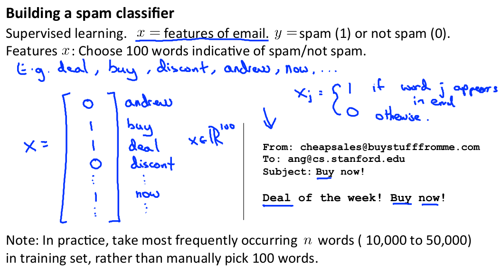

# Week 6

##Advice for Applying Machine Learning

### Evaluating a Learning Algorithm

##### Deciding what to try next

1.  Debugging a learning algorithm

   1. Suppose you have implemented regularized linear regression to predict housing prices. And it's error function is
      $$
      J(\theta)\ =\ \frac{1}{2m}\Bigg[ \sum_{i=1}^{m}(h_\theta(x^{(i)})-(y^{(i)}))^2+\lambda\sum_{i=1}^{m}\theta^2_j\Bigg]
      $$
      But, when you test our hypothesis on a new set of houses, you find that it meakes uunacceptably large errors in its predictions.

   2. What you have to next

      - Get more training examples
        - But note that, collecting more training data doesnt make always more accurate prediction. But why? and any other ideas to avoid that? $\rightarrow$next video
      - Try smaller sets of features
        - To prevent overfitting
      - Try getting additional features
        - To prevent underfitting
      -  Try adding polynomial features
      - Try decreasing $\lambda$
      - Try increasing $\lambda$

##### Evaluating a hypothesis

1. Dividing dataset into training set and test set

   1. Typically, training set and test set might be split into 70%, 30% of randomly sorted dataset.
   2. notation
      1. $m$ = number of training example
      2. $m_{test}$ = number of test example

2. Training / testing procedure for **linear regression**

   1. Learn parameter $\theta$ from training data(minimizing training error $J(\theta)$)

   2. compute test set error

   3. $J(\theta)$
      $$
      J(\theta)\ =\ \frac{1}{2m}\Bigg[ \sum_{i=1}^{m}(h_\theta(x^{(i)})-(y^{(i)}))^2\Bigg]
      $$

3. Training / testing procedure for **logistic regression**

   1. Learn parameter $\theta$ from training data

   2. compute test set error

   3. $J(\theta)$

      1. In general,
         $$
         J(\theta)\ =\\ -\frac{1}{m}\Bigg[
         y^{(i)}\log h_\theta(x^{(i)})
         +(1-y^{(i)})\log h_\theta(x^{(i)})
         \Bigg]
         $$

      2. 0/1 Misclassification error

         - An lternative test sets metric that might be easier to interpret

         - $$
           err(h_\theta(x),y)\ = \left\{ \begin{array}{}
           1 & \textrm{if $ h_\theta(x)\geq0.5,\ y=0\\$
           or $ h_\theta(x)<0.5,\ y=1$}\\
           2 & \textrm{otherwise}
           \end{array}\right.
           \\
           J(\theta)\ = \frac{1}{m}\sum_{i=1}^{m}err(h_\theta(x^{(i)}),y^{})
           $$

##### model selection and train / validation / test sets

1. Model selection problem

   1. $d$ = defree of polynomial
   2. when we select a model, there are many choices according to $d$.
   3. 

2. Evaluating a hypothesis

   1. Typically, training set and cross validation set(CV) and test set might be split into 60%, 20%, 20%.

   2. notation

      - $m_{CV}$ = number of CV example

   3. 

   4. Error function

      1. training error
         $$
         J_{train}(\theta) = \frac{1}{2m}\sum_{i=1}^{m}(h_\theta(x^{(i)})-y^{(i)})^2
         $$

      2. CV error
         $$
         J_{CV}(\theta) = \frac{1}{2m_{CV}}\sum_{i=1}^{m_{CV}}(h_\theta(x_{CV}^{(i)})-y_{CV}^{(i)})^2
         $$

      3. test error
         $$
         J_{test}(\theta) = \frac{1}{2m_{test}}\sum_{i=1}^{m_{test}}(h_\theta(x_{test}^{(i)})-y_{test}^{(i)})^2
         $$

3. Procedure for selecting model

   1. Create models by $d$
   1. Calculate each $\theta^{(d)}$ which makes $min_{\theta^{(d)}} J_{train}({\theta}^{(d)})$.
   2. Find $d$ which makes $min J_{CV}({\theta}^{(d)})$. that is our model.
   3. Estimate the generalization using $J_{test}({\theta}^{(d)})$.

4. Additional note

   - Using the same data for the purpose of the validation set and for purpse of the test set is not such a good idea.
   - So, let's separate train, validation, test set.

### Bias vs Variance

##### Diagnosing bias vs variance

1. high bias(=underfit)  / "just right" / high variance(=overfit) by **{$d$}**
   
2. The error according to $d$
   1. The bigger (degree of polynomial)$d$ is, the smaller $J_{train}(\theta)$ is. But, if $d$ is so much small or bigger, $J_{CV}(\theta)$ will be high cause of high bias or high variance.
   2. 
   3. So, using the value of $J_{train}(\theta)$ and $J_{CV}(\theta)$, we can diagnose whether the model of a particular $d$ is bias or "just right" or variance.

##### Regularization and bias / variance

1. Function of the regularization $J(\theta)$

   1. note that $d$ is already fixed.
   2. extra regularization term with regularization parameter **{$\lambda$}**

   $$
   J(\theta)\ =\ \frac{1}{2m}\Bigg[ \sum_{i=1}^{m}(h_\theta(x^{(i)})-(y^{(i)}))^2+\frac{\lambda}{2m}\sum_{i=1}^{n}\theta^2_j\Bigg]
   $$

2. The error according to  $\lambda$

   1. 
   2. 
   3. $J_{test}(\theta)$ is similar as $J_{train}(\theta)$ or $J_{CV}(\theta)$.

3. Procedure for selecting $\lambda$

   1. Create a list of lambdas
   2. Create a set of models with different degrees or any other variants.**(???)**
   3. Calculate each $\theta^{(\lambda)}$ which makes $min_{\theta^{(\lambda)}} J({\theta}^{(\lambda)})$.
   4. Find the combo($\theta$  and $\lambda$) which makes $min J_{CV}({\theta})$ **without** regularization term or λ = 0. And that is our  regularization parameter.
   5. Using the best combo($\theta$  and $\lambda$), Estimate the generalization using $J_{test}({\theta})$.

##### Learning curves

1. The error according to the $m$(training set size)
   1. In high bias
      1. 
      2. If a learning algorithm is suffering from high bias, getting more training data will not help much.
   2. In high variance
      1. 
      2. If a learning algorithm is suffering from high variance, getting more training data is likely to help.

##### Deciding what to do next revisited

1. In high bias
   1. It would be shown when $J_{train}(\theta)$ is similar to $J_{CV}(\theta)$ and both of them are high.
   2. Trying getting additional features will be helpful to fix that.
   3. Trying adding polynomial features will be helpful to fix that.
   4. Trying decreasing $\lambda$ will be helpful to fix that.
   5. In **neural network**, it can be shown when parameters are few("small" NN). It is also computationally cheaper.
2. In high variance
   1. It would be shown when $J_{train}(\theta)$ is similar to $J_{CV}(\theta)$ and both of them are high.
   2. Getting more training examples will be helpful to fix that.
   3. Trying smaller sets of features will be helpful to fix that.
   4. Trying increasing $\lambda$ will be helpful to fix that.
   5. In **neural network**, it can be shown when parameters are too much("large" NN). It is also computationally expensive. Then we can fix that by separating dataset to train, CV, test set or using regularization.

## Machine Learning System Design

### Building a Spam Classifier

#####Prioritizing what to work on

1. Example of spam and non-spam
   
2. Classification problem
   1. To distinguish whether spam and non-spam, we use supervised learning.
   2. x=features of email
      y=spam(1) or not spam(0)
      features x : Choose 100 words indicative of spam/not spam
   3. 
3. Method for getting low error
   1. Colleting lots of data(E.g. "honeypot" project)
   2. Developing sophisticated features based on email routing information(from email header)
   3. Developing sophisticated features for messge body
      - "discount" and "discounts" be treated as the same word? 
      - How about "deal"and "Dealer"? 
      - Features about (.)?
   4. Developing sophisticaed algorithm to detect misspellings(e.g. m0rtagege, etc.)

##### Error analysis

1. Recommended approach
   1. Start with a simple algorithm, implement it quickly, and test it early on your cross validation data.
   2. Plot learning curves to decide if more data, more features, etc. are likely to help.
   3. Manually examine the errors on examples in the cross validation set and try to spot a trend where most of the errors were made.
   4. When we perform error analysis, using the $J_{CV}(\theta)$ is recommended rather than the $J_{test}(\theta)$. Because, If we develop new features by examining the test set, then we may end up choosing features that work well specifically for the test set, so $J_{test}(\theta)$ is no longer a good estimate
2. The importance of numerical evaluation
   1. Example of error analysis
      
   2. "stemming(어간추출)" means the removal of unwanted parts from a changed word and the extraction of the original form of the word in NLP
   3. The importance of numerical evaluation
      
3. Conclusion
   Hence, we should try new things, get a numerical value for our error rate, and based on our result decide whether we want to keep the new feature or not.

### Handling Skewed Data

##### Error metrics for Skewed classes

1. classification example
   

2. Defining Precision / Recall

   1. 

   2. Precision(정확도)
      $$
      \frac{\text{ True positives}}{\text{#predicted positive}}=\frac{\text{ True positives}}{\text{true positive+false positive}}
      $$

   3. Recall(재현률)
      $$
      \frac{\text{ True positives}}{\text{#actual positive}}=\frac{\text{ True positives}}{\text{true positive+false negative}}
      $$

3. How to learning algorithm doing

   1. If a classifier is getting high precision and high recall, then we are actually confident taht the algorithm has to be doing well, even if we have very skewed classes.
   2. Calculating precision and recall is often a much better way to evaluate our learning algorithms than looking at classification error, when the classes are very skewed

#####Trading off precision and recall

1. 
2. 

###Using Large Data Sets

##### Data for machine learning

1. 
2. 
3. 