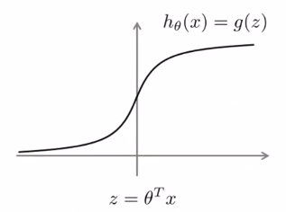

# week7

## Large Margin Classification

### Optimization Objective

1. Alternative view of logistic regression
   1. $h_\theta(x)=\frac{1}{1+e^{-\theta^Tx}}$
      
   2. ​
   3. ​
   4. ​
   5. ​
   6. If $y=1$, then $h_\theta(x)\approx1$, $\theta^Tx\gg0$
   7. If $y=0$, then $h_\theta(x)\approx0$, $\theta^Tx\ll0$
   8. ​

#### Large Margin Intution

#### Mathematics Behind Large Margin Classification

## Kernels

## SVMs in practice

