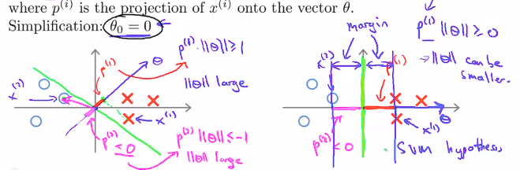
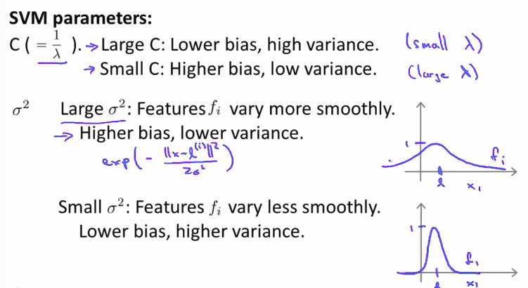

# week7

## Large Margin Classification

### Optimization Objective

1. Alternative view of logistic regression

   1. $h_\theta(x)=\frac{1}{1+e^{-\theta^Tx}}$
      

   2. If $y=1$, then $h_\theta(x)\approx1$, $\theta^Tx\gg0$

   3. If $y=0$, then $h_\theta(x)\approx0$, $\theta^Tx\ll0$

   4. Cost function
      $$
      =-(y\log h_\theta(x)+(1-y)\log(1-h_\theta(x)))
      $$

   5. Cost function according to y(1/0)
      $$
      = \left\{ \begin{array}{ll}
      cost_1(z) & \textrm{if $y=1$}\\
      cost_0(z) & \textrm{if $y=0$}\\
      \end{array} \right.
      $$
      

2. minimizing the error

   1. With regularization term
      $$
      min_\theta \frac{1}{m}\Bigg[ \sum_{i=1}^{m} y^{(i)} \Big( -\log h_\theta(x^{(i)}) \Big) + (1-y^{(i)}) \Big( -\log \big(1- h_\theta(x^{(i)}) \big) \Big) \Bigg]+\frac{\lambda}{2m} \sum_{j=1}^{n}\theta_j^2
      $$

   2. In SVM
      $$
      min_\theta C \Bigg[ \sum_{i=1}^{m} y^{(i)} cost_1(\theta^Tx^{(i)}) + (1-y^{(i)})  cost_1(\theta^Tx^{(i)})  \Bigg]+\frac{1}{2} \sum_{j=1}^{n}\theta_j^2
      $$

#### Large Margin Intution

1. Selecting thresholds for 1,-1
   
2. SVM Decision Boundary
   1. In case of $C = \text{very large}$
      1. In order to optimization, the first term is going to zero
      2. 
   2. SVM decision boundary : Linearly separable case
      1. 
      2. The black line is better than other lines, and has the largest margin. This gives the SVM a certain robustness.
      3. So, SVM is sometimes called a large margin classifier.
   3. SVM in presence of outliers
      1. 
      2. If C is large then the boundary will be like magenta line, but if C is small the boundary will be like  black line.
   4. The role of C
      1. As a regularization parameter, it works like $\frac{1}{\lambda}$
      2. If C is too large, the boundary is more sensitive to dataset, and it is high variance.
      3. If C is too small, it is high bias

#### Mathematics Behind Large Margin Classification

1. Vector inner product

   1. Suppose that
      $$
      u = \left[ \begin{array}{ll}
      u_1\\
      u_2\\
      \end{array} \right] \
      v = \left[ \begin{array}{ll}
      v_1\\
      v_2\\
      \end{array} \right]
      $$

   2. then, what is meaning of $u^Tv$?

      1. $\|u\|$
         = length of vector u
         = $\sqrt{u_1^2+u_2^2}\ \in \Re$

      2. projection of $v$ onto $u$ $\rightarrow$ $p$
         
         $p \in R$

      3. $u^Tv$
         $$
         u^Tv =u_1v_1+u_2v_2= p\cdot \|u\|\\
         =v^Tu\\
         \text{(Euclidean distance)}
         $$

2. SVM decision boundary

   1. Minimizing optimization objective $\frac{1}{2}\sum_{j=1}^{n}\theta_j^2$

      1. Let n=2, then $\theta$ is
         $$
         \theta=\left[ 
         \begin{array}{ll}
         \theta_0 \\
         \theta_1 \\
         \theta_2
         \end{array}
         \right]
         $$
         To simplify, let $\theta_0$=0. Then
         $$
         \theta=\left[ 
         \begin{array}{ll}
         \theta_1 \\
         \theta_2
         \end{array}
         \right]
         $$

      2. $$
         \frac{1}{2}\sum_{j=1}^{n}\theta_j^2 = \frac{1}{2}(\theta_1^2+\theta_2^2)=\frac{1}{2}\bigg(\sqrt{\theta_1^2+\theta_2^2}\bigg)^2=\frac{1}{2}\|\theta\|^2
         $$

      3. Minimizing $\theta$ such that
         $$
         \theta^Tx^{(i)}\ge1 \ \ \ \ \text{if} \ y^{(i)}=1\\
         \theta^Tx^{(i)}\le-1 \ \text{if} \ y^{(i)}=0
         $$

      4. Meaning of $\theta^Tx^{(i)}$
         $$
         \theta^Tx^{(i)}=p^{(i)} \cdot\| \theta \| = \theta_1x_1^{(i)}+\theta_2x_2^{(i)}
         $$
         where $p^{(i)}$ is the projection of $x^{(i)}$onto the vector $\theta$
         

   2. Evaluating different decision boundaries

      1. 
      2. Right decision boundary is better hypothesis then left one. SVM will choose right one, and then $p^{(1)}$ and $p^{(2)}$ will be large whereas $\|\theta\|$ will be small.
      3. We call the distance of gap "margin". This is why the SVM ends up large margin classifier.

   3. If $\theta_0$ is not 0, a x-axis intercept of the decision boundary line is not 0.

## Kernels

1. Non-linear decisionn boundary
   1. if n=2, let's transform polynomial terms of $x$ to $f$
   2. 

2. New parameter $l$ and similarity fuction $f$ 
   1. Given $x$, compute new feature depending on proximity to landmark $l^{(1)}$, $l^{(2)}$, $l^{(3)}$
      ​

   2. In the Gaussian kernel, 
      $$
      f_i=K(x,l^{(i)})=similarity(x,l^{(i)})=exp\bigg(-\frac{\|x-l^{(i)}\|^2}{2\sigma^2}\bigg)\\
      =exp\bigg(-\frac{\sum_{j=1}^{n}(x_j-l_j^{(i)})^2}{2\sigma^2}\bigg) \\
      \sigma \text{ is just a parameter}
      $$

   3. Values of $f$ according to $x$ and $l$

      1. If $x$ is similar to $l^{(i)}$,
         $$
         f_i\approx1
         $$

      2. If $x$ is far from $l^{(i)}$,
         $$
         f_i\approx0
         $$

   4. Examples about $f$ value according to different $\sigma$
      

   5. Examples about predicted value according to different data

      1. 
      2. Each landmark is the basis for the decision boundary(red line in the picture)

3. SVM with kernels

   1. How to choose the landmarks?

      - Insert every training example's value into $l$.

   2. $$
      f^{(i)}=\left[ 
      \begin{array}{ii}
      f_0^{i}\\
      f_1^{i}\\
      \vdots \\ 
      f_j^{i}\\
      \vdots \\ 
      f_m^{i}\\
      \end{array}
      \right],
      f_0^{(i)}=1,x^{(i)}\in \Re^{n+1},
      f^{(i)}\in \Re^{m+1},
      \theta\in \Re^{m+1}
      \\
      \text{$i$ is about number of example(n), $j$ is about number of features(m)}
      $$

      주의:웅교수의 다른 슬라이드에서는 n과 m의 의미가 뒤바뀌어 있을 수 있음

   3. If we insert every training example's value into $l$, $m$ equals to $n$.

4. Hypothesis and training

   1. Hypothesis

      - Predict $y=1$ if $\theta^Tf \ge0$
      - $\theta^Tf=\theta_0f_0+\theta_1f_1+\dots+\theta_mf_m$

   2. Training
      $$
      min_\theta C \Bigg[ \sum_{i=1}^{m} y^{(i)} cost_1(\theta^Tf^{(i)}) + (1-y^{(i)})  cost_1(\theta^Tf^{(i)})  \Bigg]+\frac{1}{2} \sum_{j=1}^{n}\theta_j^2
      $$
      하지만, 트레이닝셋의 x를 landmarks의 값으로 하였는데, 트레이닝셋으로 training하는 의미가 있을까

5. Choosing parameters $C$, $\sigma^2$

   1. C(=$1/\lambda$) $\uparrow$ : bias $\downarrow$, variance $\uparrow$
   2. $\sigma^2$ $\uparrow$ : bias $\uparrow$, variance $\downarrow$
   3. 
   4. For example,
      
      In this case the prediction is overfitting. So we have to decreas $C$ or increase $\sigma^2$

## SVMs in practice

1. Use SVM software package(e.g liblinear, libsvm, ...)

2. Procedure for training using SVM

   1. Choose the parameter C
   2. Choose the kernel
      1. linear kernel(=no kernel)
      2. Gaussian kernel $\leftarrow$ the most common kernel
   3. Choose the parameter $\sigma^2$
   4. The case of using Gaussian kernel
      1. Before using Gaussian kernel, do feature scaling
      2. ​

3. Other choices of kernel

   1. In order to using Kernel, this kernel need to satisfy a technical condition called "Mercer's Theorem"
   2. Many off-the-shelf kernels available
      - polynomial kernel
        e.g. $k(x,l)=(x^Tl+1)^2$
      - String kernel
      - chi-square kernel
      - histogram intersection kernel

4. Multi-class classification

   1. 
   2. Use one-vs-all method
   3. If number of classes are K, $y\in \{ 1,2,3,...,K\}$

5. Logistic regression vs SVM

   1. If there are many features
      e.g. features = 10000, training examples = 10~1000

      - use logistic regression, 
      - or SVM without a kernel

   2. If there are few features, intermediate training examples
      e.g. features = 1~1000, training examples = 10~10000

      - use SVM with Gaussian kernel

   3. If there are few features, many training examples
      (e.g. features = 1~1000, training examples = ~50000)

      - Add more features
      - then use logistic regression or
      - SVM without kernel

   4. Logistic regression and SVM without a kernel both of them have similar algorithm and similar performance.

   5. Well designed neural network works well for all of these different regimes. But, the neural network might be slow to train when feature or examples are huge.

   6. SVM has a convex optimization problem. So good SVM software package will always find the global minimum.

      ​