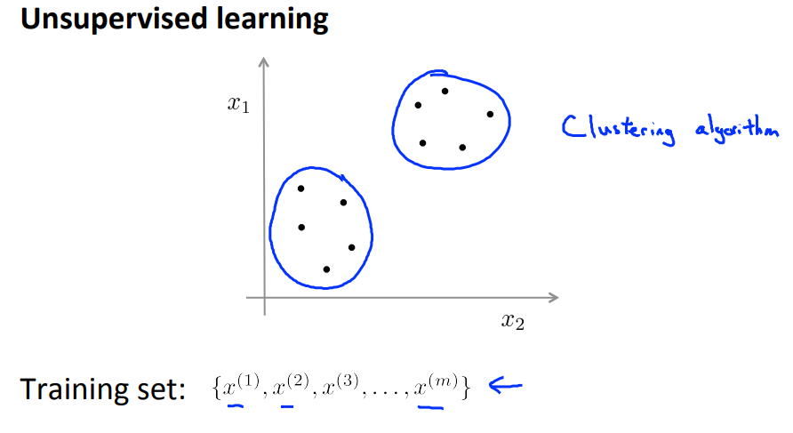

# week8

## Unsupervised learning

Unsupervised learning way is to train models with unlabeled dataset. In contrary to supervised learning, It does not ask lots of labeling cost. The one of unsupervised learning way is "Clustering". 

- supervised learning example

  

- unsupervised learning example

  

## K-means algorithm

The most famous clustering algorithm is K-means. 

- step 1) Randomly initialize K points, called the cluster centroids. Look at the figure (b)
- step 2) Assign each data to a cluster, which is the closest one among K cluster centroids. Look at the figure (c)
- step 3) Calculate new centroids by averaging all data of each cluster. Look at the figure (d)
- step 4) Repeat step 2 and step 3 until the members of each cluster are note changed. 

### K-means optimization objective function

​	
$$
J(c^{1},...,c^m, \mu_1, ...\mu_K) = \frac{1}{m}\sum^m_{i=1}||x^i - \mu_{c^{i}}||^2
$$

​	Therefore we want to find $$c^i$$ which means index of cluster to which data $$x^i$$ is currently assigned and $$\mu_i$$ which means cluster centroid of cluster to which data $$x^i$$ has been assigned.

### Random Initialization

Actually recommended way to randomly initialize centroids of clusters is to choose K examples randomly.  However There is a problem of local optimum. Look at the figures followed.

By randomly initializing centroids of clusters, you can get unlucky results felt into local optima. The simple solution for this is to try many times to find global optima which makes objective function $$J$$ minimal.

### Choosing the value of K

Downstream : choose the value of K with your purpose

Upstream : choose the value of K with elbow method like figures followed.

